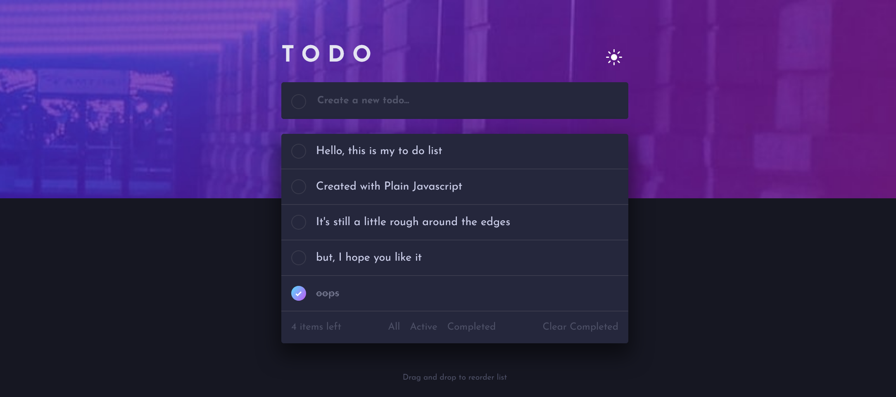
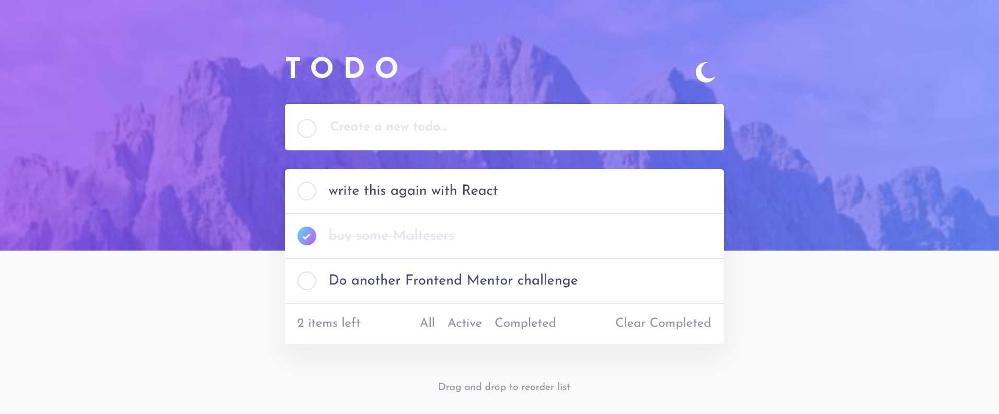

# Frontend Mentor - Todo app solution

This is a solution to the [Todo app challenge on Frontend Mentor](https://www.frontendmentor.io/challenges/todo-app-Su1_KokOW). Frontend Mentor challenges help you improve your coding skills by building realistic projects. 

## Table of contents

- [Overview](#overview)
  - [The challenge](#the-challenge)
  - [Screenshot](#screenshot)
  - [Links](#links)
- [My process](#my-process)
  - [Built with](#built-with)
  - [What I learned](#what-i-learned)
  - [Continued development](#continued-development)
  - [Useful resources](#useful-resources)
- [Author](#author)

**Note: Delete this note and update the table of contents based on what sections you keep.**

## Overview

### The challenge

Users should be able to:

- View the optimal layout for the app depending on their device's screen size
- See hover states for all interactive elements on the page
- Add new todos to the list
- Mark todos as complete
- Delete todos from the list
- Filter by all/active/complete todos
- Clear all completed todos
- Toggle light and dark mode
- **Bonus**: Drag and drop to reorder items on the list

### Screenshot

Add a screenshot of your solution. The easiest way to do this is to use Firefox to view your project, right-click the page and select "Take a Screenshot". You can choose either a full-height screenshot or a cropped one based on how long the page is. If it's very long, it might be best to crop it.

Alternatively, you can use a tool like [FireShot](https://getfireshot.com/) to take the screenshot. FireShot has a free option, so you don't need to purchase it. 

Then crop/optimize/edit your image however you like, add it to your project, and update the file path in the image above.

**Note: Delete this note and the paragraphs above when you add your screenshot. If you prefer not to add a screenshot, feel free to remove this entire section.**

### Links

- Solution URL: [https://www.frontendmentor.io/solutions/created-with-html-sass-and-plain-javascript-SgxKf0lyU](https://www.frontendmentor.io/solutions/created-with-html-sass-and-plain-javascript-SgxKf0lyU)
- Live Site URL: [https://zen-spence-1e582f.netlify.app/](https://zen-spence-1e582f.netlify.app/)

## My process

### Built with

- Semantic HTML5 markup
- CSS custom properties
- Flexbox

### What I learned

Learned how to use the Drag and Drop methods included in html.

### Continued development

I would like to improve the drag and drop and how it is handled in future projects. I would also like to try and rectreate this app with React.

### Useful resources

- [https://developer.mozilla.org/en-US/docs/Web/API/HTML_Drag_and_Drop_API](https://developer.mozilla.org/en-US/docs/Web/API/HTML_Drag_and_Drop_API) - This is a good reference for the drag and drop features available.
- [https://www.javascripttutorial.net/web-apis/javascript-drag-and-drop/](https://www.javascripttutorial.net/web-apis/javascript-drag-and-drop/) - This is a good basic tutorial to really get and understanding of how to implement a drag event.

## Author

- Frontend Mentor - [@mattyd96](https://www.frontendmentor.io/profile/mattyd96)

